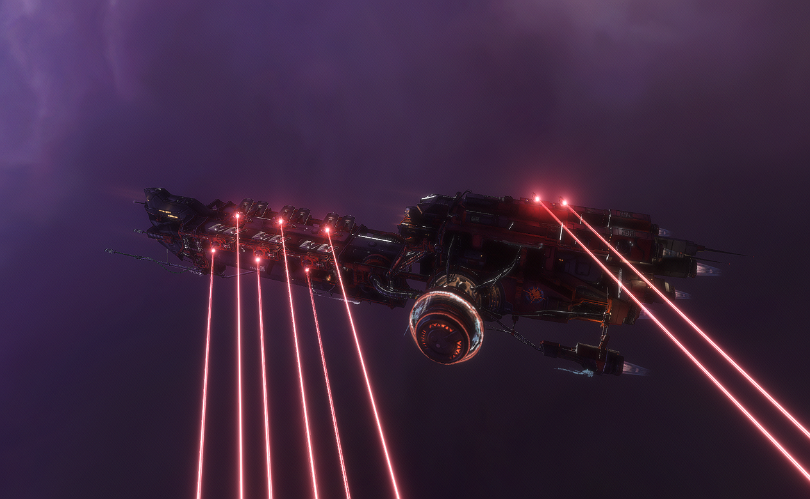
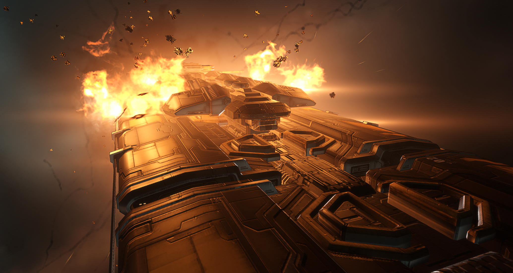
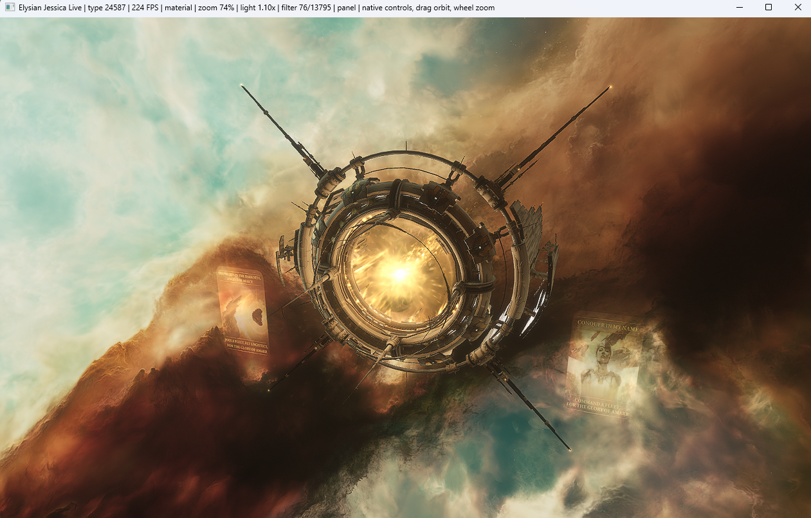
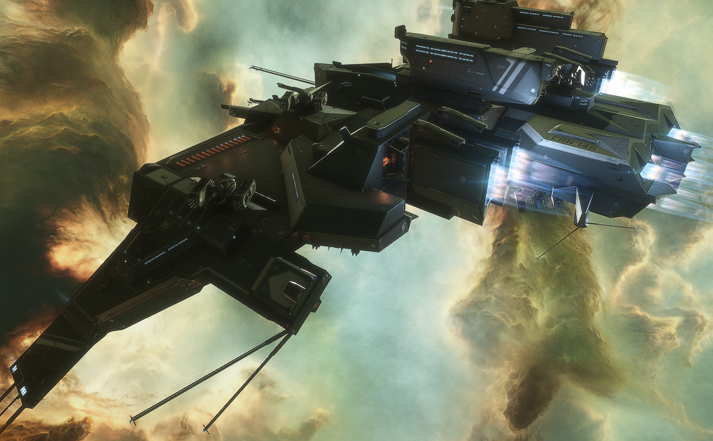
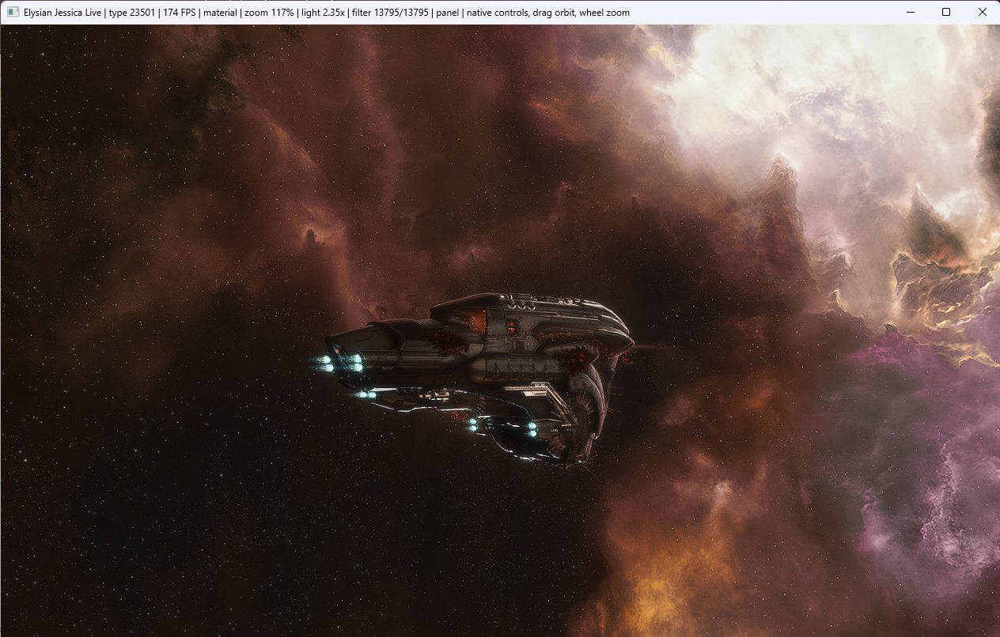
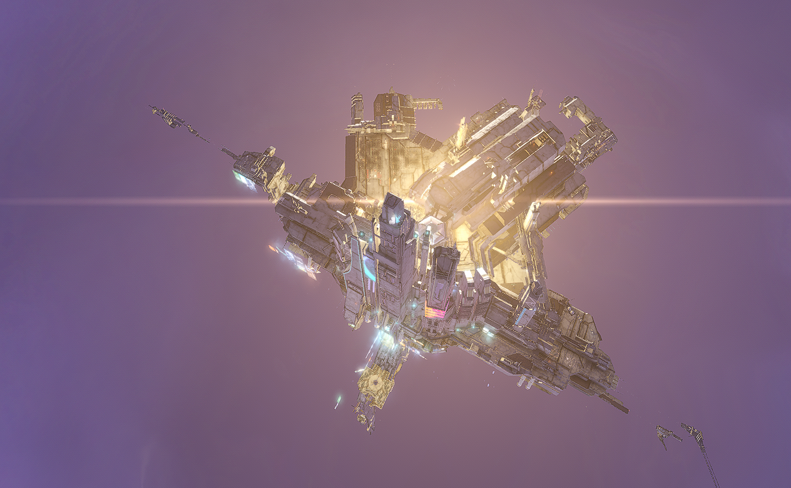
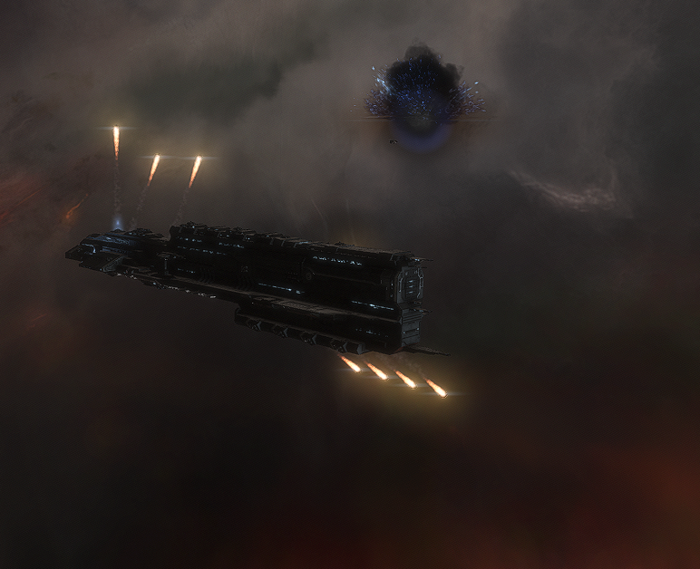
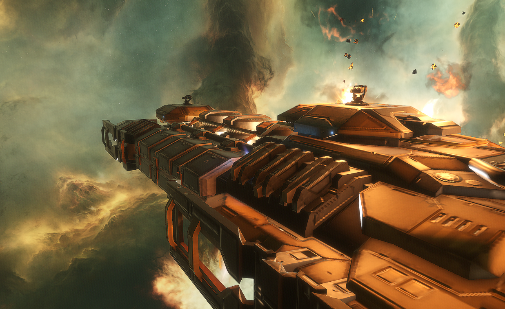

# Elysian Jessica - Trinity Viewer

<p align="center">
  <a href="https://github.com/JohnElysian/Eve-Online-Trinity-Viewer/releases/latest">
    
  </a>
  <a href="https://github.com/JohnElysian/Eve-Online-Trinity-Viewer/releases/download/v0.2/ElysianJessica-v0.2.zip">
    
  </a>
  <a href="https://github.com/JohnElysian/Eve-Online-Trinity-Viewer/blob/main/LICENSE">
    
  </a>
  
</p>

<p align="center">
  <a href="https://www.youtube.com/watch?v=LrjwBPszgYA">
    
  </a>
</p>

<p align="center">
  <strong>A native Trinity-powered viewer for exploring EVE Online ships, structures, weapons, explosions, nebulas, and model animations.</strong>
</p>

<p align="center">
  <a href="https://www.youtube.com/watch?v=LrjwBPszgYA">
    
  </a>
</p>

Jessica runs against your own installed EVE Online client and uses the same
native Blue/Trinity rendering stack that EVE uses. It does not ship CCP assets;
it reads them from your local EVE installation.

## Highlights

- Native EVE Trinity rendering through the installed client runtime.
- Searchable asset catalogue for ships, gates, stations, structures, drones,
  and other space objects.
- Real EVE nebulas and lighting controls.
- Authored model animation/state controls where a model exposes them.
- Real turret and launcher hardpoint mounting.
- Dummy target preview with firing cycles.
- Native projectile, beam, missile-trail, impact, booster, and explosion visual
  paths where the client asset supports them.
- Close-up camera controls for inspecting tiny and huge models.
- Local runtime catalogue generation from your own EVE client.

## Demo

Watch the v0.2 preview:

[](https://www.youtube.com/watch?v=LrjwBPszgYA)

## Screenshots

<table>
  <tr>
    <td width="50%">
      
      <br>
      <strong>Authored explosions</strong><br>
      Ship destruction effects and debris paths rendered through the installed
      EVE client runtime.
    </td>
    <td width="50%">
      
      <br>
      <strong>Structures and gates</strong><br>
      Inspect ships, gates, stations, structures, and other SOF-driven scene
      assets.
    </td>
  </tr>
  <tr>
    <td width="50%">
      
      <br>
      <strong>Close inspection</strong><br>
      Orbit, pan, and zoom in close enough to inspect hull details, boosters,
      turret mounts, and lighting.
    </td>
    <td width="50%">
      
      <br>
      <strong>EVE nebula scenes</strong><br>
      Cycle through real client nebula and lighting setups for cinematic asset
      previews.
    </td>
  </tr>
</table>

<details>
  <summary>Full screenshot gallery</summary>
  <p align="center">
    
    
    
    
    
    
    
    
  </p>
</details>

## Quick Start

1. Download the latest release from:
   <https://github.com/JohnElysian/Eve-Online-Trinity-Viewer/releases/latest>
2. Extract the zip somewhere writable.
3. Run:

```bat
StartTrinityViewer.bat
```

On first launch Jessica will try to find your EVE install. If it cannot, choose
the folder that contains `tq`, or choose the `tq` folder itself.

Jessica stores local settings and generated runtime files in:

```text
runtime/
```

To choose a different EVE client later:

```bat
StartTrinityViewer.bat -ResetClient
```

## Requirements

- Windows.
- A current EVE Online client installation.
- PowerShell.
- Node.js for catalogue generation when running directly from source. The
  release zip includes a generated metadata catalogue, so most users do not
  need Node.js.

Python 2.7 is prepared automatically when needed. If the bundled runtime is not
present, Jessica downloads and extracts the official Python 2.7.18 runtime into
the local tool folder.

## Controls

- Left-drag: orbit the model.
- Right-drag: pan the camera target.
- Mouse wheel: zoom in and out.
- Right-click: show or hide the Jessica control panel.
- `Esc`: close the viewer.
- `Space`: pause or resume animation.
- `W`: cycle render modes.
- `A`: run a known model activation path when available.
- `B`: toggle boosters.
- `N`: cycle nebula/background.
- `L`: change lighting.
- `+` / `-`: zoom.

Inside the floating panel:

- **Search** filters the local asset catalogue.
- **Filter checkboxes** narrow by ships, gates, stations, structures,
  published assets, animations, and explosions.
- **Animation** lists model states/controllers/curves Jessica can discover.
- **Weapon** selects turret or launcher families.
- **Arm Max** mounts weapons on available turret hardpoints.
- **Fire Dummy** spawns a target and cycles fire until stopped.
- **Explode** plays the authored explosion resource when one is available.
- **Nebula**, **Light**, **Post**, and **After FX** tune the scene.

## Building A Local Catalogue

The source repository does not include EVE assets or generated client data. The
release zip includes a generated metadata catalogue for convenience; it contains
viewer metadata and resource paths, not EVE models, textures, audio, binaries,
or `ResFiles`.

When running from source, Jessica can build its local runtime catalogue after
you select an EVE client.

Manual rebuild:

```bat
node build_standalone_catalog.js --client-root C:\CCP\EVE\tq --output runtime\catalog.json
```

The generated `runtime/catalog.json` is local runtime data and should not be
committed to source control.

## What This Repository Does Not Include

This repository does not include EVE Online game assets, client binaries,
patched client files, Wwise banks, textures, models, or `ResFiles`.

Jessica requires a legitimate local EVE Online installation and reads resources
from that installation at runtime.

## Third-Party And Legal Notes

Jessica is an independent community tool and is not affiliated with CCP Games.

EVE Online, CCP, Carbon, Trinity, and related names/assets are trademarks or
property of CCP Games. CCP has released Carbon Engine repositories including
Trinity under open-source licenses, but those licenses do not grant rights to
redistribute EVE Online game content.

See [THIRD_PARTY_NOTICES.md](THIRD_PARTY_NOTICES.md) for more detail.
